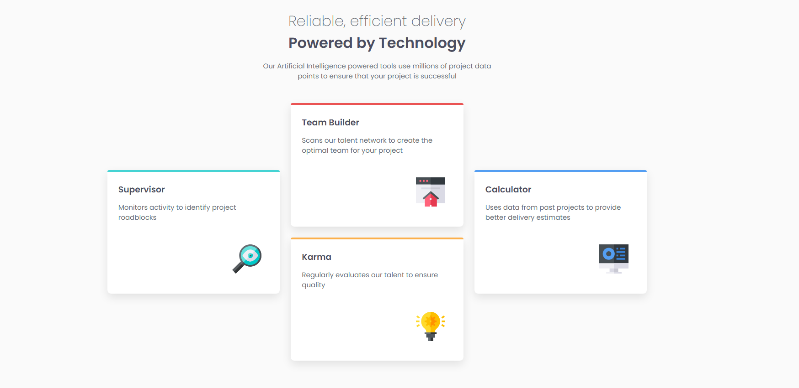
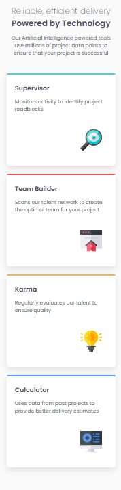

# Four Card Feature Section

Este projeto é uma solução para o desafio [Four Card Feature Section](https://www.frontendmentor.io/challenges/four-card-feature-section-weK1eFYK) do Frontend Mentor. O objetivo era criar uma seção de recursos com um layout responsivo, utilizando HTML e CSS.

## Visão Geral

### O Desafio

O desafio consistia em:
- Criar uma seção de recursos com quatro cards.
- Garantir que o layout fosse responsivo e se adaptasse a diferentes tamanhos de tela.
- Alinhar as imagens à direita de cada card.
- Manter o design o mais próximo possível do modelo fornecido.

### Screenshot




### Links

- [Solução no Frontend Mentor](https://www.frontendmentor.io/solutions/four-card-feature-section-using-css-grid-and-flexbox-9JZ5X5Q5W)
- [Live Site](https://cadanieldev.github.io/four-card-feature/) <!-- Substitua pelo link do seu projeto online -->

## Meu Processo

### Tecnologias Utilizadas

- HTML5
- CSS3
  - Flexbox
  - CSS Grid
- Metodologia BEM (opcional)
- Design Responsivo

### O que Aprendi

- **CSS Grid**: Aprendi a utilizar o CSS Grid para criar layouts complexos e responsivos.
- **Flexbox**: Utilizei Flexbox para alinhar elementos dentro dos cards.
- **Design Responsivo**: Apliquei media queries para garantir que o layout se adaptasse a diferentes dispositivos.
- **Alinhamento de Imagens**: Utilizei `margin-left: auto` para alinhar as imagens à direita dos cards.

### Dificuldades e Desafios

- **Alinhamento das Imagens**: Inicialmente, tive dificuldades para alinhar as imagens corretamente à direita, mas consegui resolver utilizando `display: flex` e `margin-left: auto`.
- **Responsividade**: Garantir que o layout funcionasse bem em dispositivos móveis foi um desafio, mas as media queries ajudaram a resolver isso.

### Melhorias Futuras

- Adicionar animações suaves ao passar o mouse sobre os cards.
- Implementar dark mode.
- Melhorar a acessibilidade com ARIA labels e contrastes de cores.

## Como Executar o Projeto

1. Clone o repositório:
   ```bash
   git clone https://github.com/seu-usuario/four-card-feature-section.git